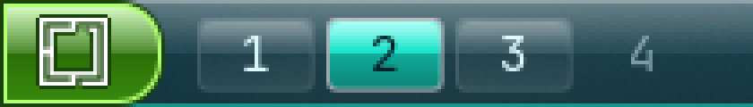
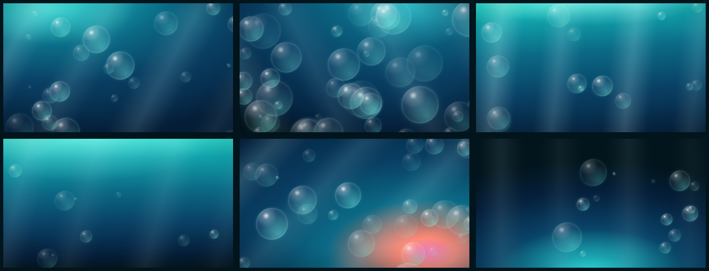

# Frutiger Aero for Omarchy

A Frutiger Aero theme for [Omarchy](https://omarchy.org/) — the glass-and-water
look of 2004–2013, in the *Deep Reef* direction: looking down into the water
rather than up at the sky. Aquamarine and deep teal, with coral, sunfish yellow
and anemone pink carrying the ANSI colours.



It is more than a palette. Omarchy's shell is Quickshell, which means QML, which
means the bar can do things a colour scheme cannot — real gradients, a specular
cap, a moulded break line. So the bar is glossy, the workspaces are little
screens, and the menu button is a Windows XP Media Center start button.



## What's here

| path | |
|---|---|
| `themes/frutiger-aero/` | the theme: palette, window chrome, shell surfaces, six 4K backgrounds |
| `plugins/genkerensky.bar/` | the bar, forked to add gloss to the strip itself |
| `plugins/genkerensky.workspaces/` | workspaces as 16:10 gel panels |
| `plugins/genkerensky.aero-menu/` | the XP Media Center menu button |
| `hooks/theme-set.d/` | swaps the bar in and out with the theme |
| `hypr/` | blur tuning and layer rules to merge into your own config |
| `tools/` | regenerate the backgrounds |
| `assets/` | Omarchy's mark as an SVG path |

## Install

```bash
git clone https://github.com/GenKerensky/omarchy-frutiger-aero
cd omarchy-frutiger-aero

cp -r themes/frutiger-aero  ~/.config/omarchy/themes/
cp -r plugins/genkerensky.* ~/.config/omarchy/plugins/
omarchy hook install theme-set hooks/theme-set.d/aero-bar.hook

omarchy theme set "Frutiger Aero"
omarchy bar use genkerensky.bar     # or just let the hook do it
```

Then merge `hypr/blur-layer-rules.lua` into `~/.config/hypr/hyprland.lua` and
`hypr/looknfeel-snippet.lua` into `~/.config/hypr/looknfeel.lua`. Both matter —
see below.

Finally, put the Aero button in the bar in place of the stock one. Edit
`~/.config/omarchy/shell.json`: swap the `omarchy.menu` entry in
`bar.layout.left` for `genkerensky.aero-menu`, and add `omarchy.menu` to the
top-level `plugins` array.

That second half is not optional. Taking `omarchy.menu` out of the bar layout
flips it to disabled, and it owns the menu overlay — so the button would open
nothing. Listing it under `plugins` keeps the overlay loaded without putting its
button back in the bar. (`omarchy plugin list` still reports it as `disabled`;
that label tracks bar-widget presence. Confirm it works by firing the IPC:
`omarchy-shell shell toggle omarchy.menu '{"menu":"root"}'` should create an
`omarchy-menu` layer.)

## Three things worth knowing

**Blur is the whole effect, and vibrancy is the setting that matters.** The
theme runs blur at `size 10, passes 3` with **`vibrancy 0.40`**, up from the
0.17 default. Vibrancy re-saturates what it blurs, which is exactly what Vista's
composited glass did; without it you get frost, not Aero.

**`~/.config/omarchy/shell.toml` overrides every theme.** Omarchy loads the
theme's `shell.toml` first and yours on top, and *user keys win*. If yours pins
`background-alpha` or `text`, it will flatten this theme's per-surface glass —
and a forced white bar text makes the clock invisible on any light theme. Keep
that file to genuinely machine-level things like `[font] base-size`.

**`~/.config/hypr/looknfeel.lua` loads after the theme.** Anything it sets in
`decoration` beats the theme. Keep it to `blur.enabled` and let the theme own
rounding, shadow and blur tuning — that is all `hypr/looknfeel-snippet.lua` is.

## Full-screen overlays need a different blur threshold

Blurring shell layers at `ignore_alpha = 0.01` is right for the bar and
notifications, where the only near-transparent pixels are rounded corners that
would otherwise pick up a square halo.

It is wrong for the menu. That is a full-screen layer — a dim scrim covering the
display with the card floating on it — so at 0.01 Hyprland blurs the scrim too
and the entire desktop goes soft behind the menu. The scrims sit at 0.45–0.55
and the cards composite to roughly 0.8, so `hypr/blur-layer-rules.lua` splits
the namespaces into two groups at **0.65**: the card frosts, the desktop stays
sharp.

Polkit deliberately stays in the panel group. Obscuring the desktop behind a
password prompt is a focus cue, not a bug.

## Regenerating the backgrounds

The wallpapers are generated rather than sourced, so they match `colors.toml`
exactly — Hyprland's blur takes its colour from whatever sits behind the glass,
so a background that drifts from the palette drags every translucent surface
with it.

```bash
tools/render-backgrounds.sh          # needs python3 + chromium
```

## Caveats

`plugins/genkerensky.bar/` is a fork of Omarchy's bar, frozen at 4.0.1, so
upstream bar fixes will not reach you. It changes five hunks in one file;
everything else is verbatim upstream. See [NOTICE.md](NOTICE.md), which records
each change and why — including the upstream bug that makes *any* custom bar
fail to load, and takes the documented fallback down with it.

Built against Omarchy 4.0.1, Hyprland 0.56.2, Qt 6.11.

## License

MIT. Portions derived from Omarchy, also MIT — see [NOTICE.md](NOTICE.md).
